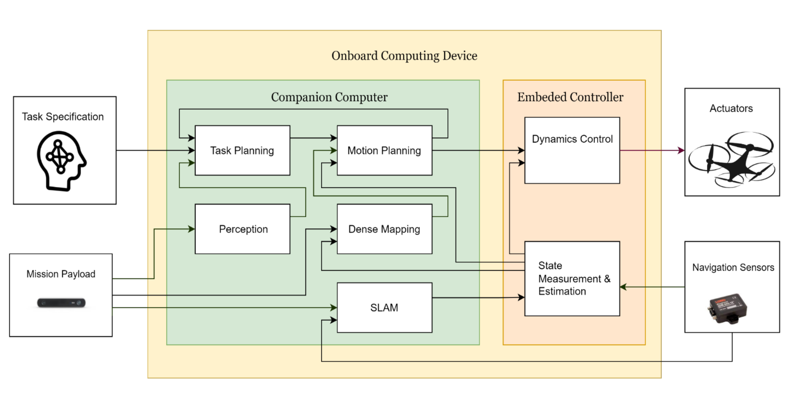

This is the home page of the **Fundamental System**.

The **Fundamental System** is a system integrating the different modules necessary for the UAVs to carry out tasks, once implemented, the system would be able to facilitate end users to test their algorithms conveniently and migrate these solutions to the real-world actuators without much extra effort.

The logo stands for the integration of various components into the system to finally solve the puzzle.

We have proposed the current framework for the whole system in the following graph:

As shown in the picture above, the primal component contains a companion personal computer(CPC), QgroundControl(QGC), Pixhawk4(PX4) firmware, and Gazebo. The diagram of the whole system can be found in the figure above. CPC is the AI program that runs on the onboard computer of a UAV. It usually contains two main parts: perception and planning, which will be discussed in detail in the following sections. QGC serves as an interface for users to control UAVs. End-users can easily assign flight schedules and monitor the UAV status via QGC. PX4 runs the flight control and scheduling algorithms on-the-fly which should be of high reliability and be designed with caution. Gazebo is a physical engine to simulate the interaction between UAVs and the real world. It contains the physical model of the world and the dynamics of the vehicle. Even weather conditions like wind and the amount of sunshine can also be involved in the simulation. 

The system contains different modules adopting both ROS and ROS2 topics. ROS (Robot Operating System) and ROS2 are both open-source software frameworks for developing robotics applications. However, there are some key differences between the two:

- ROS is based on a publish-subscribe communication model, while ROS2 uses a more flexible data-driven communication model.
- ROS is designed to support a wide range of hardware architectures and operating systems, while ROS2 is specifically designed for distributed systems and cloud-based applications.
- ROS has a large and active community of users and developers, with a wealth of available resources and support, while ROS2 is still relatively new and has a smaller community.
- ROS uses a monolithic architecture with a centralized master node, while ROS2 uses a microservices architecture with distributed nodes.
- ROS uses Python and C++ as its main programming languages, while ROS2 adds support for additional languages such as Java and Rust.

Overall, while ROS and ROS2 have many similarities, ROS2 offers a number of improvements and enhancements over ROS, making it better suited for certain types of applications and scenarios.

To make a trade-off between the abundance of ROS packages and the benefits of ROS2 such as higher robustness from distributed architecture, we adopt both ROS and ROS2 modules shown as follows:

As shown in the image, the modules like SLAM, LTL planning, motion planning, and obstacle estimation will communicate via ROS1 topic, and the Task planning with behavior tree will rely on the Nav2 of ROS2 to carry out the task. The Pixhawk commander will coordinate both ROS environments.

> You can also visit the [fundamental simulator](http://fundamentalsystem.net/publications/) for more information

## The draft version of the scheme is available [here](http://fundamentalsystem.net/files/schemeNov22.pdf).

