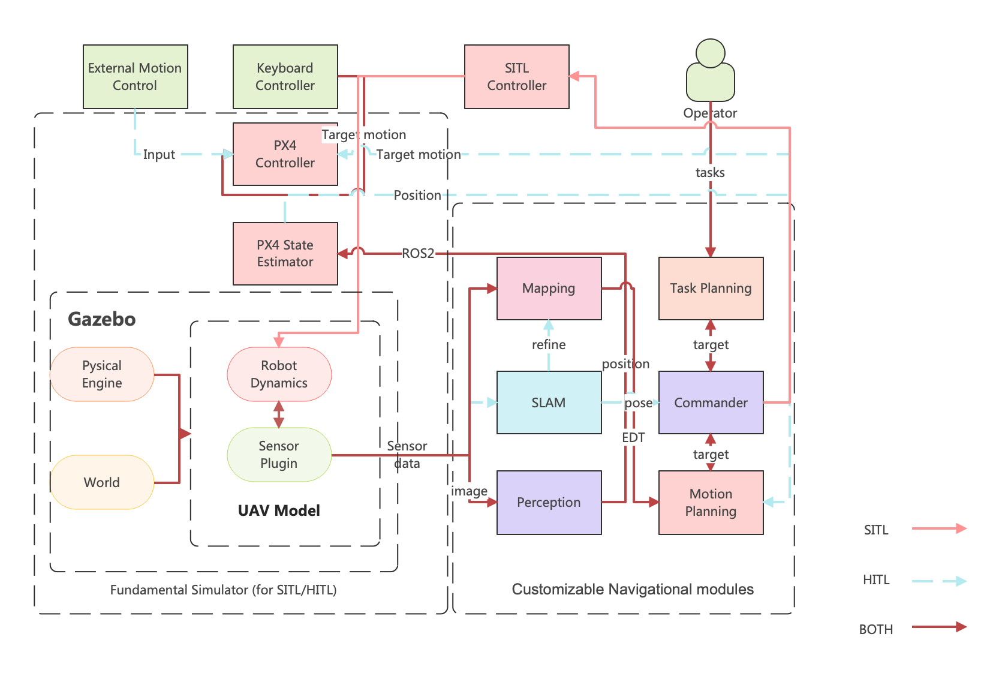



The Fundamental Simulator is the subsystem to be implemented in the Fundamental System. The draft framework will be shown as follows:

As illustrated in the graph above, we design an architecture for the simulation environment. The end-user parts are considered to show the interaction with the simulator in order to better illustrate the workflow of the proposed architecture. The simulator will support both SITL and HITL modes for smooth transitions from simulation to real-world UAV tasks. Depending on the algorithms used, the Gazebo provides world and UAV models, as well as custom-define sensor models. Users can then operate the UAVs with keyboard controllers to perceive the environment and compare the algorithm's estimation with the simulator's ground truth. The navigation modules are divided into separate modules that include localization, planning, and mapping components that the end user can customize for specific usage. Furthermore, because

the simulator runs on ROS2, these modules communicate and coordinate with one another via ROS2 topics. The communication between ROS2 and PX4 will also include PX4-supplied methods. In the early stages of SITL, the perception and planning modules, along with other components, run on the host. The user can begin by using QgroundControl to schedule flights and monitor drone status. The simulator will then instruct the sensors plugin in Gazebo to retrieve data from the environment and send it for navigation tasks such as perception and mapping. The situation in HITL would become more complicated with the introduction of environmental factors such as drone communications, weather, and human interruptions. In HITL mode, the navigation modules run on the UAV's onboard computer, and the Gazebo serves as an intermediary between the PX4 controller and the navigational modules.

**The development of the Fundamental Simulator will follow the paradigm of Model-driven Architecture (MDA).** 

Model-driven Architecture (MDA) is a software development approach that focuses on using models to represent and manipulate the elements of a software system. In the context of robotics, MDA can be used to develop and maintain large-scale robotic software systems, such as those used in autonomous vehicles, drones, and other robotics applications.

MDA has many advantages in the context of robotics, including:

- Improved scalability and modularity: MDA allows large-scale robotic software systems to be divided into smaller, independent modules, which can be developed and maintained separately. This makes it easier to scale the software system as needed, and to add or remove modules without affecting the overall system.
- Increased reusability: MDA allows software modules and components to be easily reused in different contexts and applications. This can reduce the time and effort required to develop new robotic software systems, and can help to ensure that the software is of high quality and reliability.
- Better maintainability: MDA provides a clear and consistent framework for developing and maintaining robotic software systems. This makes it easier to understand the software system and to make changes and improvements as needed.
- Improved interoperability: MDA allows robotic software systems to be integrated and combined with other systems and technologies, which can improve the overall functionality and performance of the system.
- Enhanced flexibility and adaptability: MDA allows robotic software systems to be easily adapted and extended to meet changing requirements and needs, which can improve the overall agility and responsiveness of the system.

Overall, using MDA in the development of large-scale robotic software systems can provide many benefits, including improved scalability, modularity, reusability, maintainability, interoperability, and flexibility.

The development of a robotic software system using Model-driven Architecture (MDA) typically involves the following steps:

1. Identify the requirements for the robotics software system and define the overall functionality and features that it will need to provide. This may include the type of robot that the software will be used for, the tasks that the robot will need to perform, and the operating environment in which the robot will be deployed.
2. Create a high-level model of the robotics software system using a modeling language, such as the Unified Modeling Language (UML) or the Entity-Relationship (ER) model. This model should capture the main components of the system and the relationships between them. For example, the model may include classes for representing the robot, its sensors and actuators, and the algorithms and control logic that govern its behavior.
3. Define the data model for the robotics software system, including the structure and types of data that it will need to manipulate. This model can be created using a specialized modeling language, such as the Eclipse Modeling Framework (EMF) or the Object Constraint Language (OCL). The data model may include classes for representing the robot's state, its sensor readings, and the commands that are sent to its actuators.
4. Use a model-driven development tool, such as the Eclipse Modeling Framework (EMF) or the Model Driven Architecture Development Environment (MDA-DE), to generate the code for the robotics software system from the high-level and data models. This generated code will provide the basic structure and functionality of the software, including classes for representing the robot and its components, as well as methods for manipulating the data and controlling the robot.
5. Implement any custom code or functionality that is not covered by the generated code. This can include the core algorithms and control logic for the robotics software system, as well as user interfaces and other user-facing features.
6. Test and validate the robotics software system to ensure that it meets the requirements and functions as expected. This may involve simulating the robot's environment and tasks, as well as testing the software on a physical robot.
7. Deploy the robotics software system and provide ongoing maintenance and support. This may involve integrating the software with other systems and tools, as well as providing updates and fixes as needed.

For the requirement specification stage, we will:

1. Identify the problem or need that the robotics software will address. This may involve consulting with stakeholders, such as robot manufacturers, end users, or other experts, to understand the specific challenges and opportunities that the software will need to address.
2. Define the overall goals and objectives for the robotics software system. This may include specifying the tasks that the robot will need to perform, the operating environment in which the robot will be deployed, and any performance or reliability requirements that the software will need to meet.
3. Identify the specific features and capabilities that the robotics software system will need to provide in order to achieve its goals and objectives. This may include defining the types of sensors and actuators that the robot will need to use, the algorithms and control logic that will govern its behavior, and any user interfaces or other user-facing features that the software will need to include.
4. Develop a high-level design for the robotics software system that outlines its overall architecture and the main components and interactions between them. This design can help to ensure that the software system is modular and extensible, and that it can be easily tested, validated, and maintained.
5. Create a detailed requirements specification for the robotics software system that outlines all of the functional and non-functional requirements that it will need to meet. This specification can serve as a reference for the development team and help to ensure that the software is designed and implemented to meet the needs of the stakeholders.

After the Requirement Specification, we will then march toward the domain model construction. The steps will be:

1. Choose a modeling language that is suitable for the purposes. The Unified Modeling Language (UML) is a widely-used modeling language that is well-suited to represent the components and relationships of a software system. The Entity-Relationship (ER) model is another option that is commonly used for representing the data and relationships of a software system.
2. Identify the main components of the robotics software system and the relationships between them. This may include the robot, its sensors and actuators, the algorithms and control logic that govern its behavior, and any user interfaces or other user-facing features.
3. Use the chosen modeling language to create a high-level model of the robotics software system. This may involve defining classes and relationships to represent the main components of the system and their interactions. The model should provide a high-level overview of the software system and its main components, without going into too much detail.
4. Use diagrams and other visual elements to represent the model in a clear and understandable way. UML and ER diagrams are commonly used for this purpose, and can help to communicate the structure and relationships of the software system to stakeholders and other members of the development team.
5. Review and refine the high-level model as needed. This may involve consulting with stakeholders and other members of the development team to ensure that the model accurately reflects the requirements and functionality of the software system. It may also involve updating the model as the development process progresses and the software system evolves.

And the stage to define the data model for the robotics software system will incorporate:

1. Identifying the types of data that the robotics software system will need to manipulate. This may include data about the robot's state, such as its position and orientation, as well as data from its sensors and actuators, such as camera images and motor commands.
2. Choosing a modeling language that is suitable for representing the data model. The Eclipse Modeling Framework (EMF) is a popular modeling language for defining data models and provides a range of tools and libraries for working with the data model in a software development environment.
3. Defining the data model using the chosen modeling language. This may involve defining classes and attributes to represent the different types of data, as well as relationships between the data to capture the dependencies and constraints that exist between them.
4. Generating diagrams and other visual elements to represent the data model in a clear and understandable way. EMF provides tools for generating diagrams that show the structure and relationships of the data model, which can be useful for communicating the data model to stakeholders and other members of the development team.
5. Reviewing and refining the data model as needed. This may involve consulting with stakeholders and other members of the development team to ensure that the data model accurately reflects the requirements and functionality of the robotics software system. It may also involve updating the data model as the development process progresses and the software system evolves.

After the data model(including PIM and PSM) are well-structures, we will :

1. Install the chosen model-driven development tool, such as the Eclipse Modeling Framework (EMF) or the Model Driven Architecture Development Environment (MDA-DE). These tools typically support multiple programming languages, including C++, and provide the necessary tools and libraries for working with the high-level and data models and generating the code for the software system.
2. Import the high-level and data models into the development tool. This will allow you to access and manipulate the models within the development environment.
3. Configure the code generation settings for the development tool. This may involve specifying that the code will be generated in C++, the location where the generated code will be stored, and any custom options or settings that are specific to the chosen development tool.
4. Generate the code for the robotics software system from the high-level and data models. The development tool will use the models to generate the necessary C++ code for the software system, including classes for representing the robot and its components, as well as methods for manipulating the data and controlling the robot.
5. Review the generated code to ensure that it is correct and complete. The generated code may require some manual modifications or additions to implement any custom functionality or features that are not covered by the models.
6. Integrate the generated code into the rest of the robotics software system. This may involve importing the generated code into the development environment, linking it with any custom C++ code that has been written, and testing and debugging the resulting software system.

Then for custom codes, we can:

1. Identify the specific functionality or features that need to be implemented. This may include the core algorithms and control logic for the robotics software system, as well as user interfaces and other user-facing features.
2. Choose a programming language and development environment that are suitable for implementing the custom code. This may involve considering factors such as the performance and scalability requirements of the software system, the availability of libraries and frameworks that support the chosen language, and the preferences and expertise of the development team.
3. Write the custom code to implement the desired functionality or features. This may involve creating new classes and methods, as well as modifying or extending the generated code to integrate the custom code with the rest of the software system.
4. Test and debug the custom code to ensure that it functions as expected. This may involve running the software system in a simulation or on a physical robot and using tools such as debuggers and profilers to identify and fix any issues with the code.
5. Integrate the custom code with the rest of the robotics software system. This may involve importing the custom code into the development environment, linking it with the generated code and any other custom code that has been written, and testing and debugging the resulting software system.

Testing and validation is a critical step in the development process for a robotics software system and can help to ensure that the software system is robust, reliable, and capable of meeting the requirements of the robot and its operating environment. To fully test the simulator, we can:

1. Identify the specific requirements and functionality that the robotics software system needs to meet. This may include the tasks that the robot is expected to perform, the operating environment in which it will be deployed, and any performance or reliability requirements that the software system needs to satisfy.
2. Develop a comprehensive testing plan that covers all of the requirements and functionality of the robotics software system. This plan may include a range of different test cases, including unit tests that focus on specific components or features of the software system, and integration tests that evaluate the overall performance and functionality of the system.
3. Create test data and test scenarios that will be used to evaluate the robotics software system. This may involve simulating the robot's environment and tasks, as well as using real-world data from sensors and actuators.
4. Run the tests and evaluate the results to determine whether the robotics software system meets the requirements and functions as expected. This may involve using a range of tools and techniques, such as automated test runners, debuggers, and performance profilers, to identify and diagnose any issues with the software system.
5. Address any issues or defects that are discovered during testing, and retest the software system to ensure that it meets the requirements and functions as expected. This may involve modifying the code or the test data, as well as working with stakeholders and other members of the development team to resolve any problems or challenges that are encountered.

At last, after the intensive tests, we will finally deploy the fundamental simulator to validate its availability and compatibility in hardware environments. In addition, providing ongoing maintenance and support is an important part of the development process and can help to ensure that the software system is reliable, effective, and easy to use. It can also help to build trust and confidence among users, and support the long-term success of the robotics software system.

# Changelogs


  


